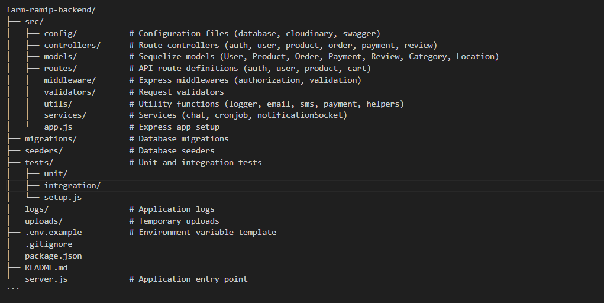

# Farm-RAMIP Backend API

## Description

Farm-RAMIP Backend API is a scalable server-side solution for an agricultural marketplace. It supports:

- User authentication and authorization
- Product listing and management
- Order processing and tracking
- Payment integration (MTN Mobile Money, Airtel Money)
- Real-time notifications (SMS, Email)
- Market analytics and reporting
- File upload and management
- Location-based services

## Project Structure



## Getting Started

1. **Clone the repository**
   ```sh
   git clone <your-repo-url>
   cd farm-ramip-backend
   ```

2. **Install dependencies**
   ```sh
   npm install
   ```

3. **Configure environment variables**
   - Copy `.env.example` to `.env` and update values.

4. **Run database migrations and seeders**
   ```sh
   npm run createAllTables
   npm run createAllSeeders
   ```

5. **Start the server**
   ```sh
   npm run dev 
   ```

6. **Run tests**
   ```sh
   npm test
   ```

## API Documentation

- Swagger docs available at `/api-docs` when the server is running.

## Contributing

- Fork the repository
- Create a feature branch
- Commit your changes
- Push and create a pull request

